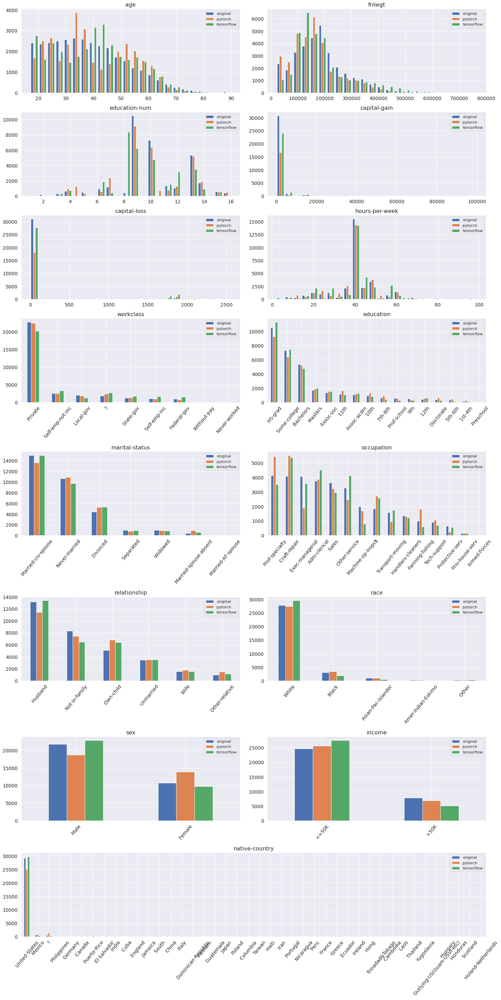

----------------------
Performance Comparison
----------------------

The goal of this project was to develop a TensorFlow implementation of the
authors' original PyTorch package.

Therefore, the outputs of training both PyTorch and TensorFlow variants should,
at least, be similar. Given that the random number generators (RNGs) from both
frameworks are not the same, even when setting the RNG seed to the same value,
the outputs would differ.

With this in mind, we set up a testing environment by loading the
`Adult Census Dataset <https://archive.ics.uci.edu/ml/datasets/adult>`_, and
running an instance of the synthesizer on 200 epochs on a given set of
discrete variables:

    >>> from ctgan.utils import load_demo
    >>> from ctgan.synthesizer import CTGANSynthesizer
    >>> data, discrete_columns = load_demo()
    >>> model = CTGANSynthesizer()
    >>> model.train(data, discrete_columns, epochs=200)
    >>> samples = model.sample(data.shape[0])

The following plots illustrate the distributions of the different solutions
for each one of the dataset features.

Taking into account this particular scenario, and remember that these can change
on a different scenario, the total execution time of the
TensorFlow implementation is slightly less than the PyTorch one, running on the
CPU.

+----------+------------+
| PyTorch  | TensorFlow |
+==========+============+
| 20min55s | 18min21s   |
+----------+------------+